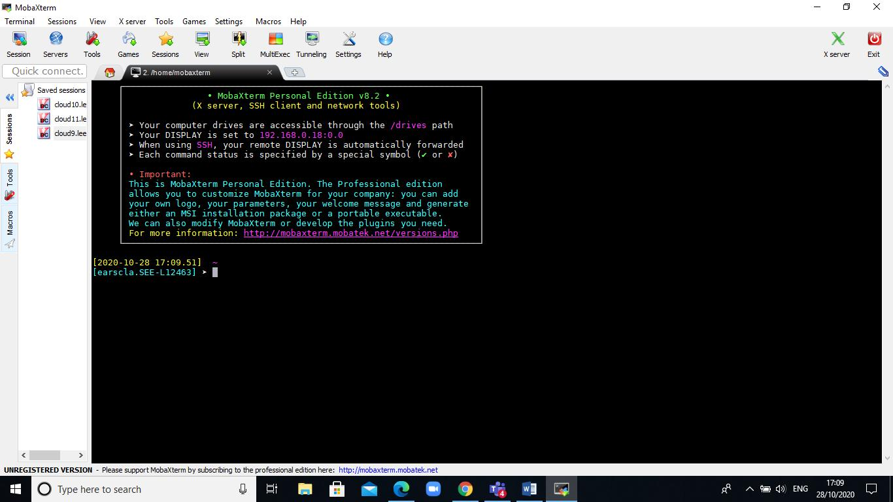

# Connecting to Aire

The official Aire system documentation is available at:

<https://arcdocs.leeds.ac.uk/aire/>

This includes information about how to connect to the system:

<https://arcdocs.leeds.ac.uk/aire/getting_started/logging_on.html>

It is possible to connect to the Aire system in various ways from on or off campus.

## For Windows users

The MobaXterm software provides various remote connection tools, and can be used to
connect to University systems via SSH.

If using a Windows computer in one of the University computer clusters, MobaXterm is available via the 'AppsAnywhere' system.

The software can be downloaded from:

<https://mobaxterm.mobatek.net/download-home-edition.html>

There are two download options – the Portable edition provides a zip file, which contains a MobaXterm executable (.exe) file.
The executable can be extracted and run without requiring any administrative privileges or running an installation process.

The Installer edition provides a traditional Windows installer (Installing in the system Program Files directory, adding shortcuts to the Start Menu, etc.).

Choose whichever version you prefer – the editions do not differ in functionality.

When MobaXterm is run, there should be a button in the centre of the windows labelled Start local terminal.

If you click on this, you should be presented with a terminal window from which commands can be run:



## For Linux or Apple users

Open a terminal program. For Apple operating systems, the default location of the Terminal program is within /Applications/Utilities.

It is possible to forward graphical output from programs on a remote machine when connecting over SSH.

For users of Apple operating systems, X11 software needs to be installed for the graphical forwarding to work.

The XQuartz software is available to provide this functionality:

<https://www.xquartz.org/>

## Connecting to Aire from the campus network

Aire can be accessed directly from a computer connected to the wired campus network.

From a terminal window, connect to Aire by running:

```
ssh -X <username>@aire.leeds.ac.uk
```

The `-X` option enables the forwarding of graphical output from programs on the remote machine.

If graphical output is not required, the option can be omitted:

```
ssh <username>@aire.leeds.ac.uk
```

## Connecting to Aire from outside the campus network (including the Eduroam wireless network)

### Connecting via the University VPN

The Aire system is accessible via the University VPN.

The IT documentation regarding connecting to the University VPN is available at:

<https://it.leeds.ac.uk/it?id=kb_article_view&sysparm_article=KB0014410>

Once a connection to the VPN has been established, the SSH connection to Aire can be as above, e.g.:

```
ssh <username>@aire.leeds.ac.uk
```

### Connecting via the SSH gateway `rash.leeds.ac.uk`

The University has a SSH gateway system, `rash.leeds.ac.uk`, which can be used to connect to systems on campus from a remote connection.

The IT documentation regarding the `rash.leeds.ac.uk` system is available at:

<https://it.leeds.ac.uk/it?id=kb_article_view&sysparm_article=KB0014674>

This information includes details on how to request access to the system.

If your username has been granted access to the `rash.leeds.ac.uk` system, it should be possible to connect via SSH:

```
ssh <username>@aire.leeds.ac.uk -J <username>@rash.leeds.ac.uk
```

The `-J` options specifies that the connection to Air should _jump_ via the `rash.leeds.ac.uk` system.

## Copying data from Aire using `scp`

The `scp` command line program allows data to be copied to and from a remote system over a SSH connection.

To copy data from Aire to your local computer, open a terminal window on your local machine (i.e. run the commands from your local machine rather than from a Leeds system) and change to the directory in to which you wish to copy the data from the remote system.

On a Linux or Apple system, you should be able to change to your user / home directory by running:

```
cd ~
```

Change to your Desktop directory with:

```
cd ~/Desktop
```

From a MobaXterm terminal on Windows, it should be possible to change to your user directory (typically `C:\Users\username`) with:

```
cd $USERPROFILE
```

Change to the Desktop directory with:

```
cd $USERPROFILE/Desktop
```

The syntax for copying a file from Aire to the current directory is:

```
scp <username>@aire.leeds.ac.uk:/path/to/file .
```

The `.` at the end of the command specifies the current directory on the local computer as the target directory to which the file will be copied.

The full command asks the `scp` program to connect to Aire, and to copy the remote file `/path/to/file` in to the current directory on the local machine.

To copy a directory and its content, the `-r` option (which asks to copy recursively) can be used:

```
scp -r <username>@aire.leeds.ac.uk:/path/to/dir .
```

If using the MobeXterm program to connect, a file browser should be visible in the left hand pane of the MobaXterm window, which will display files on the remote machine.

This file browser can also be used to transfer files to and from the remote machine.
